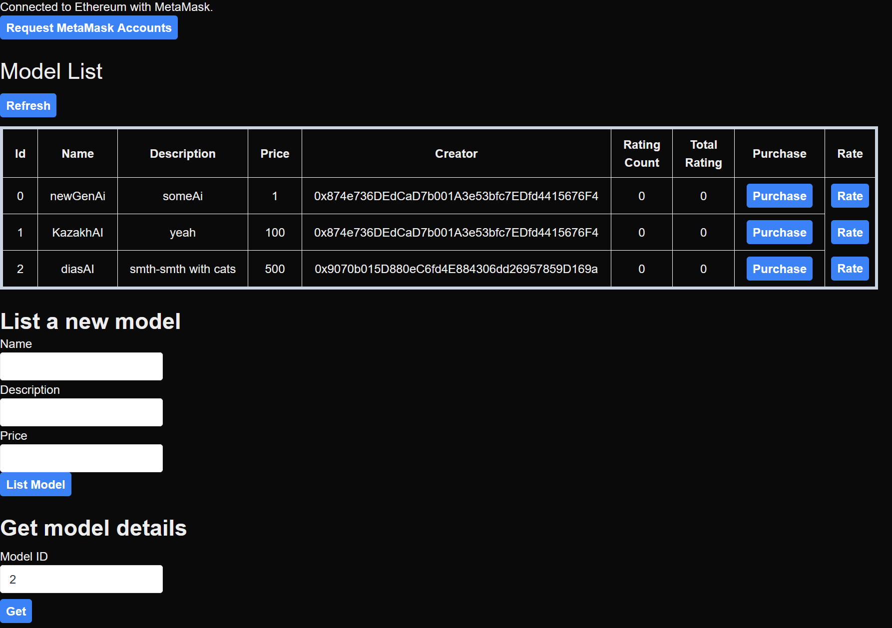
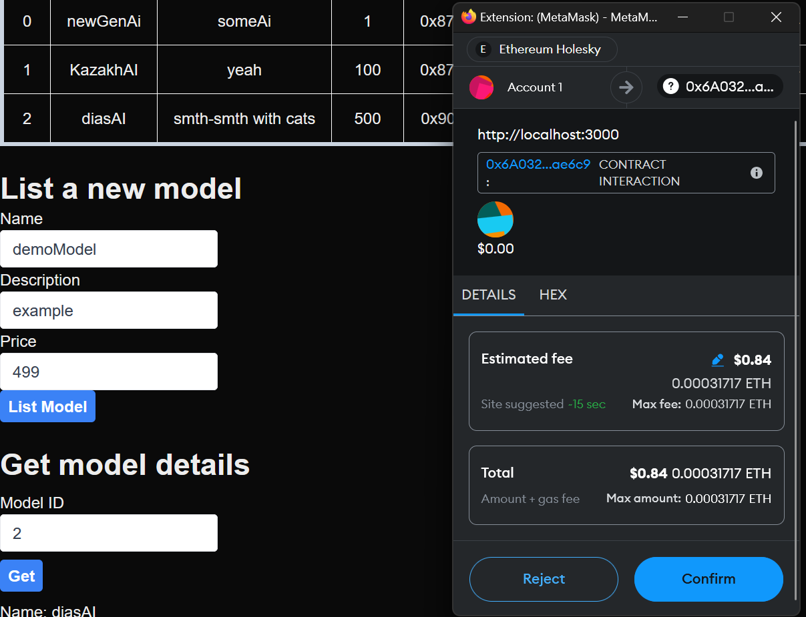
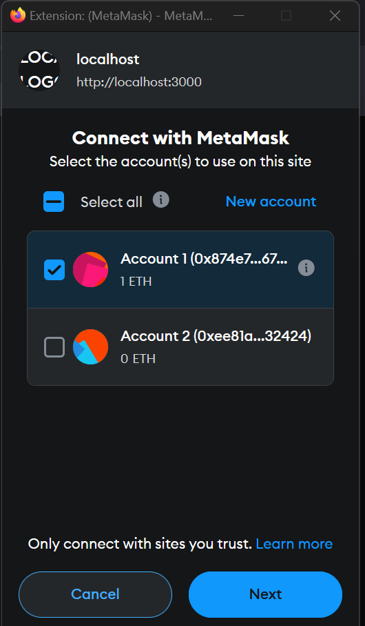
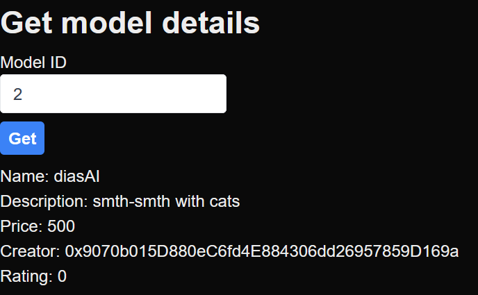
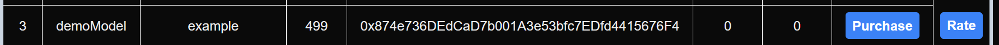

# Assignment 2

## Prerequisites

- Node >= 20
- npm >= 7

<details>

<summary>Info</summary>

Tested and works with Node 22.3.0 and npm 10.8.1

</details>

## Usage

You can try this project here: [https://crypto.abzy.kz/](https://crypto.abzy.kz/)

### Step 1

Clone the repository

```bash
git clone https://github.com/abzy128/blockchain-assignment2.git
cd blockchain-assignment2
```

### Step 2

Install dependencies for the project

```bash
cd frontend
npm install
```

### Step 3

Build the project

```bash
npm run build
```

### Step 4

Start the server

```bash
npm start
```

## Screenshots

### Main page



### Listing new model



### Logging in with Metamask



### Model details



## Examples

### Example 1

The example model

```
name = demoModel
description = example
price = 499
creator = 0x874e736DEdCaD7b001A3e53bfc7EDfd4415676F4
```


